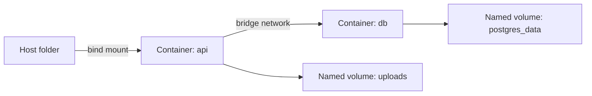

# Volumenes y redes

Los volumenes resuelven persistencia. Las redes resuelven comunicacion.

## Diagrama



## Volumenes

Crear volumen:

```bash
docker volume create postgres_data
```

Usarlo:

```bash
docker run --name postgres-demo \
  -e POSTGRES_PASSWORD=secret \
  -v postgres_data:/var/lib/postgresql/data \
  -d postgres:16
```

Listar e inspeccionar:

```bash
docker volume ls
docker volume inspect postgres_data
```

## Bind mounts

Un bind mount conecta una ruta del host con una ruta del contenedor:

```bash
docker run --rm -v "$PWD:/app" -w /app node:20-alpine node index.js
```

Usalo para desarrollo local; para datos gestionados suele ser mejor volumen nombrado.

## Redes

Crear red:

```bash
docker network create app_net
```

Ejecutar contenedores en una red:

```bash
docker run --name db --network app_net -e POSTGRES_PASSWORD=secret -d postgres:16
docker run --rm --network app_net postgres:16 psql -h db -U postgres
```

Dentro de la misma red, los contenedores se resuelven por nombre.

## Buenas practicas

- Usa volumenes para bases de datos.
- Usa bind mounts para codigo en desarrollo.
- Crea redes por proyecto.
- No publiques puertos si solo otro contenedor necesita acceder.
- Nombra volumenes y redes de forma reconocible.

## Errores comunes

- Ejecutar bases de datos sin volumen.
- Borrar volumenes pensando que solo borras contenedores.
- Usar `localhost` entre contenedores en vez del nombre del servicio.
- Publicar puertos innecesarios.

## Ejercicio

Crea una red `lab_net`, ejecuta PostgreSQL con volumen nombrado y conecta otro contenedor a esa base usando el nombre `db`.

## Recursos relacionados

- [Docker en desarrollo local](12-docker-en-desarrollo-local.md)
- [Proyecto final](16-proyecto-final.md)
