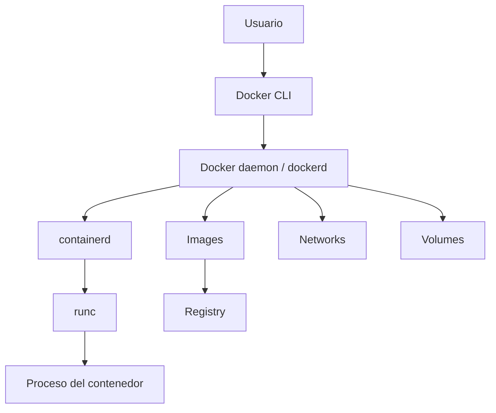
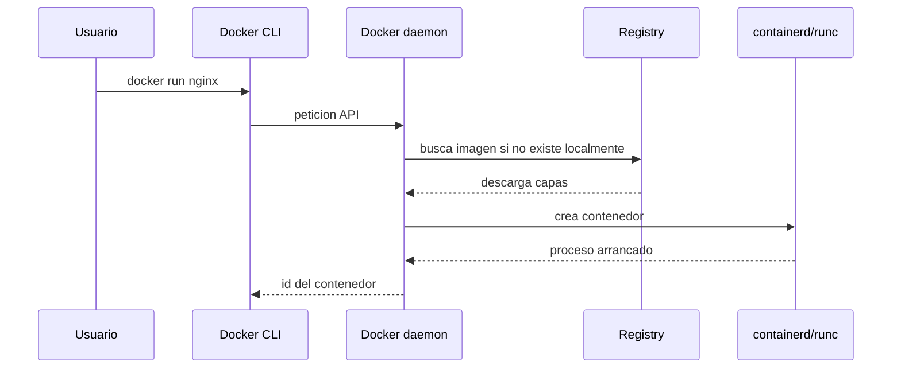

# Arquitectura interna

Docker esta formado por varias piezas. Entenderlas ayuda a diagnosticar problemas y a no tratar los contenedores como magia.

## Componentes



## Docker CLI

Es el cliente que ejecutas:

```bash
docker build
docker run
docker ps
docker logs
```

La CLI habla con el daemon mediante una API. Puede hablar con un daemon local o remoto.

## Docker daemon

`dockerd` gestiona:

- Builds.
- Imagenes.
- Contenedores.
- Redes.
- Volumenes.
- Comunicacion con registries.

Cuando haces `docker run`, no "corres Docker"; pides al daemon que cree un contenedor.

## containerd y runc

Docker delega parte del trabajo en componentes de bajo nivel:

- **containerd:** gestiona ciclo de vida de contenedores.
- **runc:** crea el contenedor usando primitivas del kernel.

`runc` es quien aplica namespaces, cgroups y montaje de filesystem.

## Flujo de docker run



## Imagen vs contenedor

```txt
imagen = plantilla inmutable
contenedor = proceso + capa escribible + configuracion de ejecucion
```

Puedes crear muchos contenedores desde la misma imagen.

## Buenas practicas

- Entiende si un fallo viene del build, del daemon o del proceso.
- Usa `docker inspect` para ver configuracion real.
- Revisa `docker info` cuando haya problemas del entorno.
- No confundas imagen con contenedor.

## Errores comunes

- Pensar que Docker es una VM.
- Modificar un contenedor manualmente y esperar que la imagen cambie.
- No distinguir problemas de red Docker y problemas de aplicacion.
- Ignorar el daemon cuando la CLI falla.
