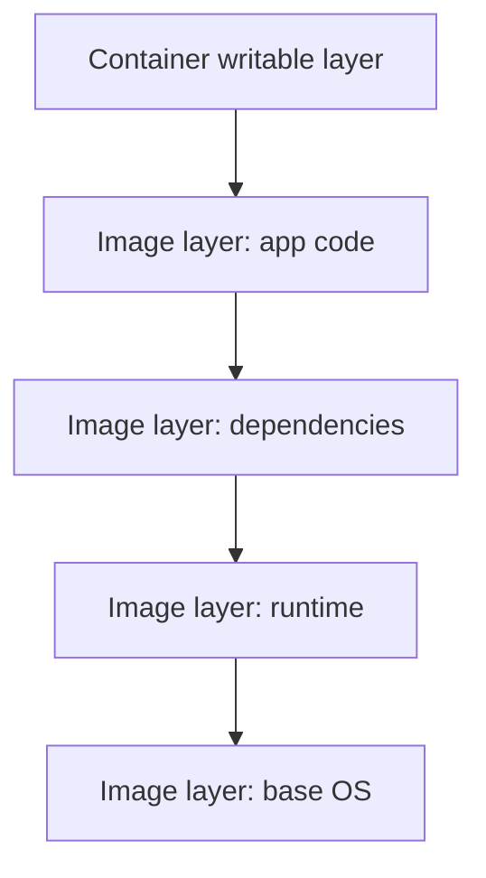

# Capas y overlay filesystem

Las imagenes Docker se construyen por capas. Cada instruccion del Dockerfile puede crear una capa reutilizable. En ejecucion, el contenedor anade una capa escribible encima de las capas de imagen.

## Diagrama



## Capas de imagen

Ejemplo:

```dockerfile
FROM node:22-alpine
WORKDIR /app
COPY package*.json ./
RUN npm ci
COPY . .
CMD ["node", "server.js"]
```

Cada paso relevante genera una capa o metadata. Si cambias `COPY . .`, Docker puede reutilizar capas anteriores.

## Cache

Docker reutiliza cache si la instruccion y sus entradas no han cambiado.

Por eso conviene copiar primero archivos de dependencias:

```dockerfile
COPY package*.json ./
RUN npm ci
COPY . .
```

Si copias todo antes de instalar, cada cambio de codigo invalida la instalacion de dependencias.

## Capa escribible

Cuando un contenedor modifica archivos, escribe en su capa propia. Si eliminas el contenedor, esa capa desaparece.

Para persistir datos usa:

- Volumenes.
- Bind mounts.
- Almacenamiento externo.

## Overlay filesystem

Docker suele usar un driver como `overlay2`. Su trabajo es presentar varias capas como si fueran un unico filesystem.

```txt
lowerdir = capas de imagen
upperdir = capa escribible del contenedor
merged = vista final dentro del contenedor
```

## Implicaciones

- Las imagenes comparten capas.
- Los builds pueden ser rapidos si cachean bien.
- Escribir muchos datos dentro del contenedor no es buena estrategia.
- Borrar archivos de una capa anterior no reduce necesariamente el tamano final si ya quedaron en una capa previa.

## Buenas practicas

- Ordena instrucciones de menos cambiante a mas cambiante.
- Usa multi-stage para no arrastrar dependencias de build.
- No escribas datos persistentes en la capa del contenedor.
- Limpia caches en la misma capa donde se generan.

## Errores comunes

- Copiar secretos y borrarlos despues: pueden quedar en una capa anterior.
- Invalidar cache con `COPY . .` demasiado pronto.
- Usar contenedores como almacenamiento.
- No entender por que una imagen pesa demasiado.
