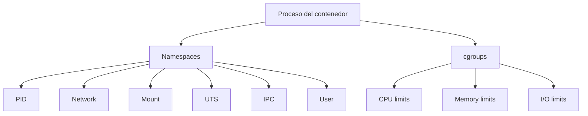

# Namespaces y cgroups

Los contenedores no son maquinas virtuales. Son procesos aislados usando funcionalidades del kernel Linux. Dos piezas clave son namespaces y cgroups.

## Diagrama



## Namespaces

Namespaces aislan lo que un proceso puede ver.

Ejemplos:

- **PID namespace:** el contenedor ve su propio arbol de procesos.
- **Network namespace:** interfaces y rutas propias.
- **Mount namespace:** filesystem montado propio.
- **UTS namespace:** hostname propio.
- **IPC namespace:** comunicacion entre procesos aislada.
- **User namespace:** mapeo de usuarios.

## cgroups

cgroups limitan y miden recursos.

```bash
docker run --memory 256m nginx
docker run --cpus 0.5 nginx
```

Esto no cambia la aplicacion; limita lo que el kernel permite consumir.

## Ver procesos

Dentro del contenedor:

```bash
docker exec -it app sh
ps aux
```

Desde el host, el proceso tambien existe, pero con otro contexto.

## Implicaciones de seguridad

Como los contenedores comparten kernel, no son una frontera de seguridad perfecta. Hay que aplicar hardening:

- No ejecutar como root.
- Limitar capabilities.
- Mantener kernel actualizado.
- Evitar montar el socket de Docker.

## Buenas practicas

- Define limites de memoria y CPU en entornos compartidos.
- No asumas aislamiento equivalente a VM.
- Usa usuarios no root.
- Reduce capabilities cuando sea posible.

## Errores comunes

- Creer que un contenedor tiene kernel propio.
- No poner limites y dejar que un contenedor consuma todo.
- Montar `/var/run/docker.sock` sin entender el riesgo.
- Ejecutar procesos privilegiados por comodidad.
