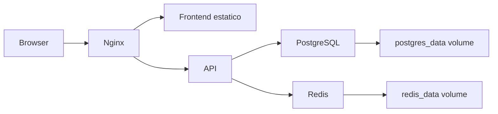

# Proyecto final

El objetivo es empaquetar una aplicacion web completa con API, PostgreSQL, Redis y Nginx. No busca sustituir el manual de Docker Compose, sino aplicar Docker en un escenario real.

## Arquitectura



## Estructura

```txt
proyecto/
  api/
    Dockerfile
    package.json
    src/
  frontend/
    Dockerfile
    nginx.conf
    package.json
    src/
  docker-compose.yml
  .env.example
```

## API Dockerfile

```dockerfile
FROM node:22-alpine AS deps
WORKDIR /app
COPY package*.json ./
RUN npm ci

FROM node:22-alpine AS runner
WORKDIR /app
ENV NODE_ENV=production
COPY --from=deps /app/node_modules ./node_modules
COPY . .
USER node
EXPOSE 3000
CMD ["node", "src/server.js"]
```

## Frontend Dockerfile

```dockerfile
FROM node:22-alpine AS build
WORKDIR /app
COPY package*.json ./
RUN npm ci
COPY . .
RUN npm run build

FROM nginx:alpine
COPY --from=build /app/dist /usr/share/nginx/html
COPY nginx.conf /etc/nginx/conf.d/default.conf
EXPOSE 80
```

## Compose de referencia

```yaml
services:
  api:
    build: ./api
    environment:
      DATABASE_URL: postgresql://app:app@db:5432/app
      REDIS_URL: redis://redis:6379
    depends_on:
      - db
      - redis

  frontend:
    build: ./frontend
    ports:
      - "8080:80"
    depends_on:
      - api

  db:
    image: postgres:16
    environment:
      POSTGRES_USER: app
      POSTGRES_PASSWORD: app
      POSTGRES_DB: app
    volumes:
      - postgres_data:/var/lib/postgresql/data

  redis:
    image: redis:7
    volumes:
      - redis_data:/data

volumes:
  postgres_data:
  redis_data:
```

## Nginx para frontend y API

```nginx
server {
  listen 80;
  root /usr/share/nginx/html;
  index index.html;

  location / {
    try_files $uri /index.html;
  }

  location /api/ {
    proxy_pass http://api:3000/;
    proxy_set_header Host $host;
    proxy_set_header X-Real-IP $remote_addr;
  }
}
```

## Validaciones

```bash
docker compose build
docker compose up -d
docker compose ps
docker compose logs api
curl http://localhost:8080
```

## Requisitos de calidad

- Imagenes multi-stage.
- API sin root.
- Variables en entorno.
- Volumenes para datos.
- Nginx como entrada unica.
- Logs por stdout/stderr.
- Healthchecks si se lleva mas lejos.
- CI que construya y publique imagenes.

## Mejoras opcionales

- Migraciones de base de datos.
- Tests en CI.
- Escaneo de imagenes.
- Secrets reales.
- HTTPS.
- Observabilidad.
- Despliegue en Kubernetes.

## Cierre

Si entiendes este proyecto, ya tienes las piezas principales: imagenes, contenedores, redes, volumenes, builds multi-stage, proxy inverso, variables, persistencia y diagnostico.
