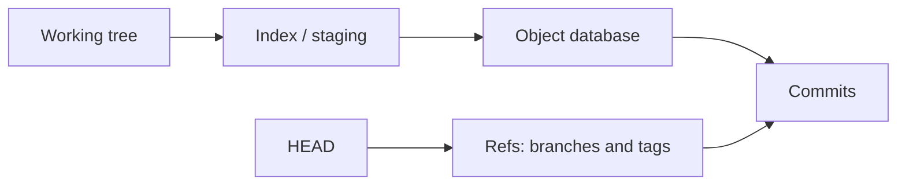
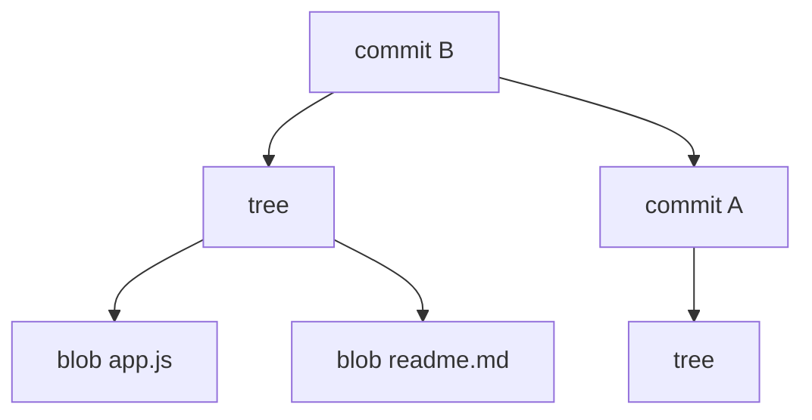
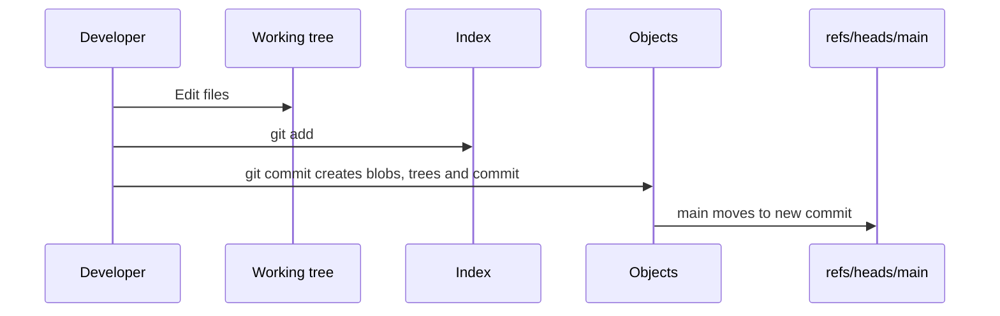

# Arquitectura interna de Git

Git parece una herramienta de comandos, pero por dentro es una base de datos de objetos con referencias humanas encima. Entender esto cambia mucho la forma de resolver errores, leer historial y trabajar con ramas.

## Idea principal

Un repositorio Git local contiene:

- Un directorio de trabajo con tus archivos.
- Un area de staging llamada index.
- Una base de datos de objetos dentro de `.git/objects`.
- Referencias dentro de `.git/refs`.
- Configuracion, hooks, logs y metadatos dentro de `.git`.



## Directorio `.git`

Cuando ejecutas:

```bash
git init
```

Git crea un directorio `.git`. Ese directorio es el repositorio real. El resto de carpetas son tu copia de trabajo.

Estructura simplificada:

```txt
.git/
  HEAD
  config
  index
  objects/
  refs/
  logs/
  hooks/
```

## Working tree

El working tree es lo que ves en tu editor: archivos modificados, borrados o nuevos.

Git no guarda automaticamente cada cambio. Primero compara el working tree con el index y con el ultimo commit.

```bash
git status
git diff
```

## Index

El index es la fotografia que estas preparando para el siguiente commit.

```bash
git add app.js
git diff --staged
```

Un error comun es pensar que `git add` solo "marca archivos". En realidad actualiza el index con el contenido exacto de esos archivos en ese momento.

## Object database

Git guarda contenido como objetos inmutables identificados por hash. Los tipos principales son:

- `blob`: contenido de un archivo.
- `tree`: estructura de directorios.
- `commit`: snapshot, autor, fecha, mensaje y padres.
- `tag`: etiqueta anotada.

Puedes inspeccionarlos:

```bash
git cat-file -t HEAD
git cat-file -p HEAD
```

## Commits como snapshots

Git no piensa principalmente en diferencias. Un commit apunta a un tree que representa el estado completo del proyecto en ese momento.



Git puede calcular diffs entre snapshots:

```bash
git diff HEAD~1 HEAD
```

## HEAD

`HEAD` indica donde estas ahora.

Normalmente apunta a una rama:

```txt
ref: refs/heads/main
```

En detached HEAD apunta directamente a un commit.

```bash
git switch --detach abc1234
```

Detached HEAD no es peligroso por si mismo, pero los commits creados ahi pueden quedarse sin rama si no los guardas.

## Refs

Una rama no es una copia de archivos. Es un puntero movible a un commit.

```txt
main -> a1b2c3
feature-login -> d4e5f6
```

Cuando haces commit en una rama, Git crea un commit nuevo y mueve el puntero de la rama.

## Flujo completo de un commit



## Comandos de inspeccion

```bash
git status
git log --oneline --decorate --graph --all
git cat-file -p HEAD
git ls-tree HEAD
git rev-parse HEAD
git rev-parse --show-toplevel
```

## Diagnostico mental

Cuando Git se comporta raro, pregunta:

- Que hay en mi working tree?
- Que hay en el index?
- A que commit apunta HEAD?
- A que commit apunta mi rama?
- Mi rama local y la remota apuntan al mismo sitio?

## Buenas practicas

- Mira `git status` antes de operaciones destructivas.
- Usa `git diff` y `git diff --staged` para separar trabajo sin preparar y trabajo preparado.
- Aprende a inspeccionar `HEAD`, ramas y commits antes de forzar cambios.
- Recuerda que las ramas son punteros, no carpetas.

