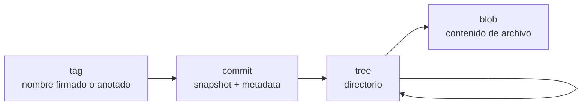
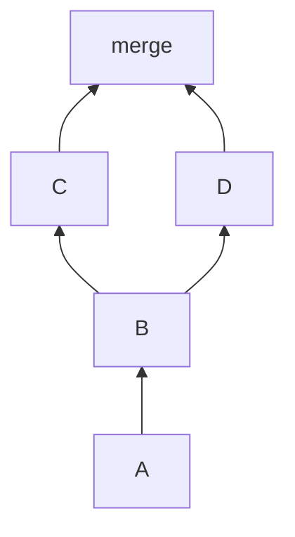
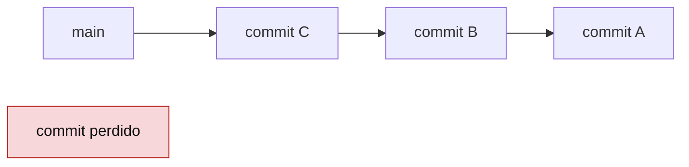

# Objetos, blobs, trees y commits

La base de datos de Git se entiende mejor si bajas un nivel y miras los objetos. No hace falta usar estos comandos todos los dias, pero conocerlos ayuda a entender por que Git puede recuperar tanto.

## Los cuatro tipos de objeto



## Blob

Un blob guarda el contenido de un archivo, no su nombre.

Puedes crear un objeto manualmente:

```bash
echo "hola" | git hash-object --stdin
```

Para guardarlo en la base de datos:

```bash
echo "hola" | git hash-object -w --stdin
```

Git calcula un hash a partir del tipo, tamano y contenido. Si dos archivos tienen el mismo contenido, pueden compartir el mismo blob.

## Tree

Un tree guarda nombres, permisos y enlaces a blobs u otros trees.

Ver el tree de un commit:

```bash
git ls-tree HEAD
git ls-tree -r HEAD
```

Ejemplo conceptual:

```txt
tree HEAD
  100644 blob a1b2c3 readme.md
  040000 tree d4e5f6 src
```

## Commit

Un commit apunta a:

- Un tree.
- Cero, uno o varios commits padre.
- Autor.
- Committer.
- Fecha.
- Mensaje.

Inspeccion:

```bash
git cat-file -p HEAD
```

Salida conceptual:

```txt
tree 9f1a...
parent 3b2c...
author Iago PL <email@example.com> 1710000000 +0100
committer Iago PL <email@example.com> 1710000000 +0100

Anade autenticacion
```

## Commit inicial

El primer commit no tiene padre.

```bash
git rev-list --max-parents=0 HEAD
```

## Merge commit

Un merge commit tiene dos o mas padres.

```bash
git cat-file -p HEAD
```

Puedes ver la forma:

```bash
git log --oneline --graph --decorate --all
```



## Diff entre commits

Git no necesita guardar un diff como pieza principal. Puede calcularlo comparando trees.

```bash
git diff HEAD~1 HEAD
git diff main feature/login
```

## Identificadores

Los hashes largos son identificadores completos. Normalmente puedes usar abreviados:

```bash
git show a1b2c3
```

Si el repositorio crece y hay ambiguedad, Git pedira mas caracteres.

## Objetos alcanzables

Un objeto es alcanzable si existe alguna referencia que permite llegar a el.



Los objetos no alcanzables no desaparecen inmediatamente. Por eso `reflog` y `fsck` pueden rescatar cambios.

## Buscar objetos sueltos

```bash
git fsck --lost-found
```

No es una herramienta de uso diario, pero puede ayudar en recuperaciones avanzadas.

## Relacion con `git add`

Cuando haces:

```bash
git add src/app.js
```

Git prepara en el index la version exacta de ese archivo. Si despues editas otra vez `src/app.js`, tendras:

- Una version en el index.
- Otra version en el working tree.

Compruebalo:

```bash
git diff
git diff --staged
```

## Buenas practicas

- Usa commits pequenos para que cada snapshot tenga sentido.
- Revisa `git diff --staged` antes de confirmar.
- No confundas nombre de archivo con blob: Git guarda contenido y estructura por separado.
- Aprende a leer `git log --graph` para entender padres y merges.

