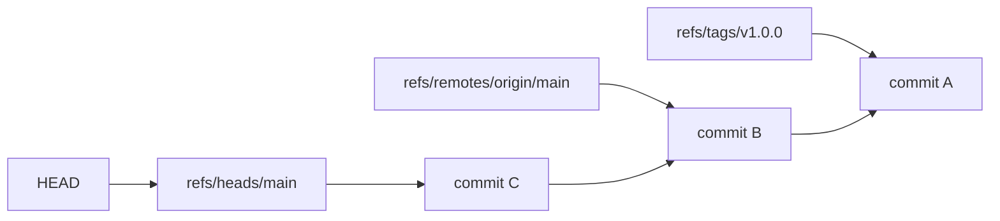

# Refs, HEAD, reflog y tags internos

Las referencias son la capa humana encima de los objetos. Sin refs, tendrias hashes. Con refs, tienes ramas, tags, remotos y una forma mucho mas comoda de navegar.

## Que es una ref

Una ref es un nombre que apunta a un commit u objeto.

Ejemplos:

```txt
refs/heads/main
refs/heads/feature/login
refs/remotes/origin/main
refs/tags/v1.0.0
```

Ver todas:

```bash
git show-ref
```

## Ramas locales

Una rama local vive normalmente en `.git/refs/heads/`.

```bash
git branch
git rev-parse main
```

Crear una rama solo crea un puntero:

```bash
git branch feature/login
```

Cambiar de rama actualiza `HEAD` y el working tree:

```bash
git switch feature/login
```

## HEAD

Ver HEAD:

```bash
git symbolic-ref HEAD
git rev-parse HEAD
```

En una rama normal:

```txt
HEAD -> refs/heads/main -> commit
```

En detached HEAD:

```txt
HEAD -> commit
```

## Detached HEAD

Puedes entrar en detached HEAD al revisar un commit antiguo:

```bash
git switch --detach HEAD~3
```

Si haces commits ahi y quieres conservarlos:

```bash
git switch -c experimento-rescatado
```

## Refs remotas

`origin/main` no es la rama remota en vivo. Es tu ultima copia conocida de la rama remota.

Actualizar referencias remotas:

```bash
git fetch origin
```

Comparar:

```bash
git log --oneline --decorate --graph main origin/main
git diff main origin/main
```

## Tracking branch

Una rama local puede seguir una rama remota.

```bash
git branch -vv
```

Configurar tracking:

```bash
git branch --set-upstream-to=origin/main main
```

Cuando hay tracking, `git pull` sabe de donde traer cambios y `git push` sabe a donde subir.

## Reflog

El reflog registra movimientos recientes de HEAD y ramas locales.

```bash
git reflog
git reflog show main
```

Es una red de recuperacion para operaciones como:

- `reset`
- `rebase`
- `commit --amend`
- cambios de rama
- merges fallidos

## Recuperar con reflog

Si perdiste un commit:

```bash
git reflog
git branch rescate abc1234
```

Si quieres volver la rama al estado anterior:

```bash
git reset --hard abc1234
```

Usa `reset --hard` solo cuando tienes claro que quieres descartar cambios del working tree.

## Tags ligeros y anotados

Tag ligero:

```bash
git tag v1.0.0
```

Tag anotado:

```bash
git tag -a v1.0.0 -m "Version 1.0.0"
```

Los tags anotados crean un objeto tag con metadatos.

## Publicar tags

```bash
git push origin v1.0.0
git push origin --tags
```

Evita publicar todos los tags si no estas seguro. En proyectos grandes puede subir tags antiguos o experimentales.

## Borrar tags

Local:

```bash
git tag -d v1.0.0
```

Remoto:

```bash
git push origin :refs/tags/v1.0.0
```

## Diagrama de refs



## Buenas practicas

- Ejecuta `git fetch` antes de comparar con remoto.
- Usa `git branch -vv` para detectar ramas sin upstream.
- Crea una rama de rescate antes de operaciones delicadas.
- Prefiere tags anotados para releases importantes.
- Revisa el reflog antes de asumir que un commit se perdio.

