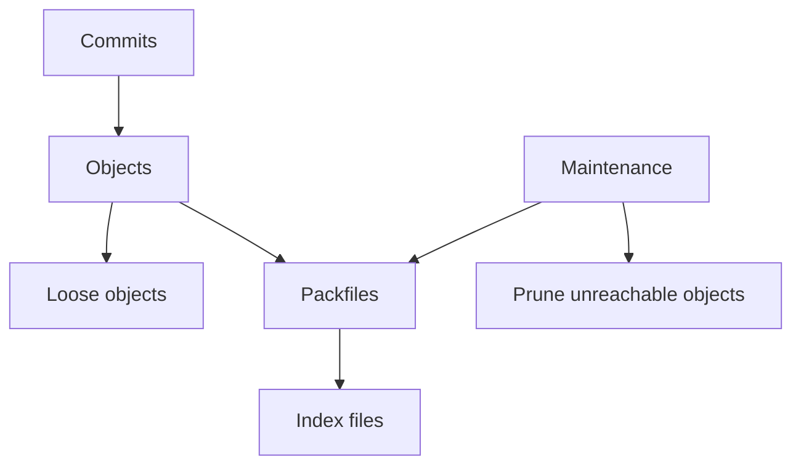

# Packfiles, GC y rendimiento

Git empieza guardando objetos sueltos, pero con el tiempo compacta esos objetos en packfiles para ahorrar espacio y acelerar operaciones. Entender esto ayuda en repositorios grandes y en problemas de rendimiento.

## Objetos sueltos

Al crear commits, Git puede guardar objetos como archivos individuales dentro de `.git/objects`.

```txt
.git/objects/
  a1/
    b2c3...
```

Esto es simple, pero no escala bien si hay miles o millones de objetos.

## Packfiles

Un packfile agrupa muchos objetos en un archivo compacto.

```txt
.git/objects/pack/
  pack-abc123.pack
  pack-abc123.idx
```

El archivo `.pack` contiene datos. El `.idx` permite buscar objetos rapidamente.

## Delta compression

Git puede guardar un objeto como diferencia frente a otro objeto parecido.

Ejemplo conceptual:

```txt
version 1: archivo completo
version 2: delta contra version 1
version 3: delta contra version 2
```

Esto es especialmente util en archivos de texto que cambian poco entre commits.

## Garbage collection

`git gc` limpia y compacta el repositorio.

```bash
git gc
```

Git tambien ejecuta mantenimiento automatico en algunos momentos.

Comando moderno:

```bash
git maintenance run
```

## Objetos no alcanzables

Despues de `reset`, `rebase` o `amend`, pueden quedar commits no alcanzables por ramas o tags. No se borran al instante.

```bash
git fsck --unreachable
```

Con el tiempo, Git puede eliminarlos durante limpieza.

## Reflog y expiracion

El reflog conserva referencias temporales a estados anteriores.

```bash
git reflog
```

Configuraciones utiles:

```bash
git config --get gc.reflogExpire
git config --get gc.pruneExpire
```

No cambies estos valores sin una razon clara.

## Repositorios pesados

Sintomas:

- `git status` tarda demasiado.
- `git checkout` o `git switch` son lentos.
- `.git` ocupa mucho.
- Clonar tarda demasiado.

Diagnostico:

```bash
git count-objects -vH
git gc --dry-run
```

## Archivos grandes

Git no es ideal para binarios pesados que cambian a menudo.

Opciones:

- Evitar subir artefactos generados.
- Usar `.gitignore`.
- Usar Git LFS para binarios necesarios.
- Separar datasets o builds en almacenamiento externo.

## Encontrar objetos grandes

Comando de investigacion:

```bash
git rev-list --objects --all
```

En shells Unix se suele combinar con `git cat-file --batch-check`, `sort` y `tail`. En Windows, conviene usar herramientas especificas o scripts controlados para no hacer una limpieza destructiva por error.

## Clones parciales y shallow clones

Shallow clone:

```bash
git clone --depth 1 https://github.com/org/proyecto.git
```

Es util para CI cuando no necesitas historial completo.

Partial clone:

```bash
git clone --filter=blob:none https://github.com/org/proyecto.git
```

Puede reducir descargas en monorepos o repos con muchos archivos grandes.

## Sparse checkout

Permite trabajar solo con parte del repositorio.

```bash
git sparse-checkout init --cone
git sparse-checkout set apps/api packages/shared
```

Es util en monorepos cuando un equipo solo toca una zona.

## Diagrama de almacenamiento



## Buenas practicas

- No subas dependencias, builds ni caches al repo.
- Usa `.gitignore` antes de hacer el primer commit del proyecto.
- Considera Git LFS para binarios grandes que deban versionarse.
- En CI, usa shallow clone solo si no necesitas tags o historial.
- Antes de limpiar historia, crea backup o rama de seguridad.

