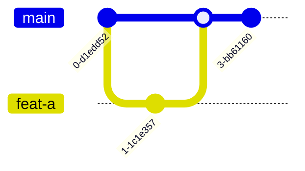

# Flujos profesionales y politicas de historial

Git no es solo comandos. En equipo, lo importante es acordar como se integra trabajo, como se revisa y que historial se quiere mantener.

## Pregunta central

Antes de elegir flujo, decide:

- El equipo trabaja con releases planificadas o despliegue continuo?
- Se permite reescribir historia compartida?
- El historial debe ser lineal?
- Hay ramas de soporte para versiones antiguas?
- Quien puede hacer merge a `main`?

## Trunk-based development

Trabajo cerca de `main`, ramas pequenas y vida corta.



Ventajas:

- Integracion frecuente.
- Menos conflictos largos.
- Encaja bien con CI/CD.

Riesgos:

- Requiere tests y feature flags.
- Las ramas largas rompen el modelo.

## GitHub Flow

Flujo comun:

1. Crear rama desde `main`.
2. Hacer commits.
3. Abrir pull request.
4. Ejecutar CI.
5. Revisar.
6. Mergear.
7. Desplegar.

Es simple y suficiente para muchos proyectos web.

## Git Flow

Usa ramas como `develop`, `release/*`, `hotfix/*` y `main`.

Puede ser util en productos con releases versionadas y mantenimiento paralelo.

Tambien puede ser pesado para equipos pequenos o despliegue continuo.

## Rebase vs merge

Merge conserva la historia real de integracion:

```bash
git merge feature/login
```

Rebase recoloca commits encima de otra base:

```bash
git rebase main
```

Regla practica:

- Rebase en tu rama local antes de compartir.
- Merge o squash segun politica del equipo al integrar.
- No rebases commits publicados si otras personas ya trabajan sobre ellos.

## Squash merge

Convierte una PR completa en un solo commit.

Ventajas:

- Historial de `main` limpio.
- Cada PR representa una unidad funcional.

Costes:

- Se pierde la granularidad interna de commits.
- Puede complicar trazabilidad si se abusa.

## Conventional Commits

Formato:

```txt
tipo(scope): descripcion
```

Ejemplos:

```txt
feat(auth): anade login con OAuth
fix(api): corrige validacion de email
docs(git): amplia capitulo de refs
```

Tipos comunes:

- `feat`
- `fix`
- `docs`
- `test`
- `refactor`
- `chore`
- `ci`

## Politicas de ramas

En repositorios profesionales suele protegerse `main`:

- Pull request obligatoria.
- Al menos una aprobacion.
- CI obligatoria.
- Bloqueo de push directo.
- Conversaciones resueltas antes del merge.
- Commits firmados si el entorno lo exige.

## Hotfix

Flujo rapido para produccion:

```bash
git switch main
git pull
git switch -c hotfix/error-login
git commit -am "fix(auth): corrige error en login"
git push -u origin hotfix/error-login
```

Despues se abre PR, se despliega y se etiqueta si aplica.

## Releases y tags

```bash
git tag -a v1.4.0 -m "Version 1.4.0"
git push origin v1.4.0
```

Una release debe poder reconstruirse desde un commit/tag concreto.

## Checklist antes de abrir PR

- `git status` limpio o con cambios esperados.
- Rama actualizada con `main`.
- Tests locales ejecutados.
- Commits con mensajes claros.
- PR pequena y revisable.
- Descripcion con contexto, decisiones y riesgos.

## Checklist antes de merge

- CI en verde.
- Conflictos resueltos.
- Review aprobada.
- Cambios de configuracion documentados.
- Migraciones revisadas si existen.
- Riesgo de despliegue entendido.

## Anti-patrones

- Ramas eternas.
- Commits gigantes sin contexto.
- Reescribir historia compartida sin avisar.
- Resolver conflictos sin ejecutar tests.
- Hacer push directo a `main` en proyectos de equipo.
- Usar `git reset --hard` como solucion habitual.

