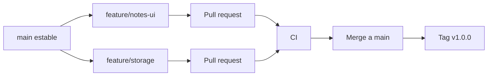

# Proyecto final: flujo completo con Git

El objetivo es simular un flujo profesional de Git desde cero: repositorio local, ramas, commits atomicos, remoto, pull request, conflicto, tag y recuperacion con reflog.

## Escenario

Vas a trabajar en una aplicacion pequena de notas.

Objetivos:

- Crear un historial limpio.
- Separar cambios por ramas.
- Resolver un conflicto.
- Etiquetar una version.
- Recuperar un commit perdido.
- Documentar una politica de trabajo.

## Arquitectura del flujo



## Preparacion

```bash
mkdir notas-git
cd notas-git
git init
git config user.name "Iago PL"
git config user.email "iago@example.com"
```

Crea archivos iniciales:

```txt
README.md
src/app.js
src/storage.js
```

Primer commit:

```bash
git add .
git commit -m "feat: crea estructura inicial"
```

## Rama de interfaz

```bash
git switch -c feature/notes-ui
```

Modifica `src/app.js`:

```js
export function renderNotes(notes) {
  return notes.map((note) => `- ${note.title}`).join("\n")
}
```

Commit:

```bash
git add src/app.js
git commit -m "feat(ui): renderiza listado de notas"
```

## Rama de almacenamiento

Vuelve a `main`:

```bash
git switch main
git switch -c feature/storage
```

Modifica `src/storage.js`:

```js
const notes = []

export function addNote(title) {
  notes.push({ title })
}

export function listNotes() {
  return [...notes]
}
```

Commit:

```bash
git add src/storage.js
git commit -m "feat(storage): anade almacenamiento en memoria"
```

## Simular remoto

Para practicar sin GitHub, crea un remoto local bare:

```bash
cd ..
git init --bare notas-git-remoto.git
cd notas-git
git remote add origin ../notas-git-remoto.git
git push -u origin main
git push -u origin feature/notes-ui
git push -u origin feature/storage
```

## Integrar primera rama

```bash
git switch main
git merge --no-ff feature/notes-ui
```

Si todo va bien:

```bash
git push origin main
```

## Crear un conflicto

En `main`, cambia `README.md`:

```md
# Notas Git

Aplicacion de notas para practicar Git.
```

```bash
git add README.md
git commit -m "docs: describe aplicacion"
```

En `feature/storage`, cambia la misma zona:

```bash
git switch feature/storage
```

```md
# Notas Git

Proyecto de practica para ramas, merges y releases.
```

```bash
git add README.md
git commit -m "docs: documenta flujo de practica"
```

Intenta integrar:

```bash
git switch main
git merge feature/storage
```

Git marcara conflicto en `README.md`.

## Resolver conflicto

Edita el archivo dejando una version final:

```md
# Notas Git

Aplicacion de notas para practicar ramas, merges y releases con Git.
```

Termina el merge:

```bash
git add README.md
git commit
```

## Ver historial

```bash
git log --oneline --decorate --graph --all
```

Comprueba:

- La rama `main` contiene ambas funcionalidades.
- El merge conflictivo queda documentado.
- Los commits explican unidades pequenas.

## Etiquetar release

```bash
git tag -a v1.0.0 -m "Version 1.0.0"
git push origin main
git push origin v1.0.0
```

## Recuperacion con reflog

Crea un commit accidental:

```bash
echo "debug=true" > debug.txt
git add debug.txt
git commit -m "chore: debug temporal"
```

Vuelve atras:

```bash
git reset --hard HEAD~1
```

Ahora rescatalo:

```bash
git reflog
git branch rescate-debug HEAD@{1}
```

Inspecciona:

```bash
git log --oneline rescate-debug -n 3
```

## Politica de trabajo propuesta

Para un proyecto real pequeno:

- `main` siempre desplegable.
- Ramas `feature/*` para cambios nuevos.
- PR obligatoria antes de merge.
- Squash merge si la PR tiene commits de prueba.
- Merge commit si interesa conservar contexto de integracion.
- Tags anotados para releases.
- `revert` para deshacer cambios ya publicados.

## Entregable final

El repositorio debe tener:

- Historial visible con `git log --graph`.
- Dos funcionalidades integradas.
- Un conflicto resuelto.
- Tag `v1.0.0`.
- Rama de rescate creada desde reflog.
- README con politica de trabajo.

## Checklist de aprendizaje

- Se distinguir working tree, index y commit.
- Se crear y publicar ramas.
- Se resolver conflictos sin borrar trabajo ajeno.
- Se usar tags para releases.
- Se usar reflog para recuperar commits.
- Se elegir entre merge, rebase, squash y revert segun contexto.

