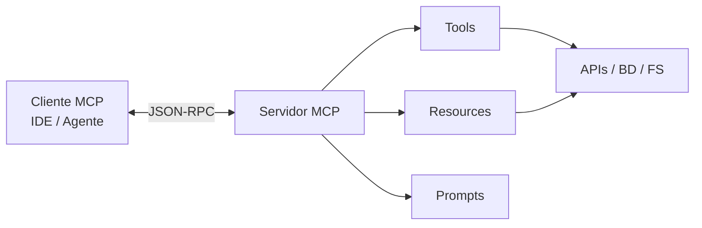

# MCP: Model Context Protocol

El **Model Context Protocol (MCP)** es un estandar abierto para conectar aplicaciones de IA (clientes) con fuentes de datos y herramientas externas (servidores MCP). Define como exponer **resources**, **prompts** y **tools** de forma uniforme.

## Capitulos

1. [Introduccion al Model Context Protocol](01-introduccion-al-model-context-protocol.md)
2. [Clientes servidores y herramientas](02-clientes-servidores-y-herramientas.md)
3. [Recursos prompts y tools](03-recursos-prompts-y-tools.md)
4. [Autenticacion y seguridad](04-autenticacion-y-seguridad.md)
5. [Construccion de un servidor MCP](05-construccion-de-un-servidor-mcp.md)
6. [Integracion con agentes](06-integracion-con-agentes.md)
7. [Buenas practicas](07-buenas-practicas.md)

## Problema que resuelve

Antes de MCP, cada IDE o agente integraba APIs propietarias:

```txt
Cursor -> integracion custom GitHub
Otro IDE -> otra integracion GitHub
App propia -> otra vez lo mismo
```

MCP estandariza el contrato:

```txt
Cliente MCP <--- protocolo ---> Servidor MCP (GitHub, DB, filesystem, ...)
```

Un servidor MCP escrito una vez puede usarse desde varios clientes compatibles.

## Arquitectura



- **Cliente:** Cursor, Claude Desktop, apps custom con SDK.
- **Servidor:** Proceso que implementa el protocolo y ejecuta acciones.
- **Transporte:** stdio (local), SSE/HTTP (remoto).

## Tres primitivas

| Primitiva | Que expone |
|-----------|------------|
| **Tools** | Acciones invocables (buscar, crear issue, query SQL) |
| **Resources** | Datos legibles (archivo, documento, esquema) |
| **Prompts** | Plantillas predefinidas para el usuario |

## Ejemplo mental

Servidor "documentacion interna":

- **Tool:** `search_docs(query)` — busca en indice.
- **Resource:** `manual://postgresql/backup` — contenido de un capitulo.
- **Prompt:** `review_api_design` — plantilla para revision de APIs.

## Casos de uso

- IDE con acceso a repos, tickets, docs.
- Agente con consultas a base de datos controladas.
- RAG empresarial con fuentes vivas.
- Automatizacion DevOps desde chat (con permisos estrictos).

## MCP vs LangChain tools

| MCP | LangChain tools |
|-----|-----------------|
| Protocolo entre procesos/apps | Funciones dentro de tu app Python |
| Reutilizable entre clientes | Acoplado a tu codigo |
| Ideal integraciones IDE | Ideal logica de negocio interna |

Pueden coexistir: cliente MCP en IDE + LangChain en backend.

## Relacion con otros manuales

- [RAG](../rag/01-introduccion-y-arquitectura.md) — recuperacion de conocimiento.
- [LangChain](../langchain/01-introduccion.md) — orquestacion de LLM y agents.

## Buenas practicas iniciales

- Empieza con un servidor pequeno (filesystem o docs).
- Tools de solo lectura antes de escritura.
- Logs de cada invocacion.
- Versiona el servidor MCP como cualquier servicio.

## Errores comunes

- Exponer demasiadas tools sin documentacion clara.
- Servidor con permisos de admin del sistema.
- Confundir MCP con el modelo LLM (MCP no es un modelo).
- No validar argumentos en el servidor.
- Transporte remoto sin TLS ni auth.

## Siguiente paso

El [capitulo 2](02-clientes-servidores-y-herramientas.md) detalla roles, transportes y ciclo de vida de una sesion MCP.
