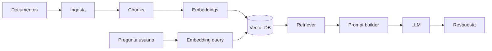

# RAG: introduccion y arquitectura

RAG (Retrieval-Augmented Generation) combina busqueda de informacion con generacion de texto mediante un modelo de lenguaje. En lugar de confiar solo en lo que el modelo aprendio durante el entrenamiento, el sistema recupera fragmentos relevantes de una base de conocimiento y los usa como contexto para responder.

Es el patron mas habitual para chatbots internos, asistentes sobre documentacion, soporte tecnico y copilotos empresariales.

## Capitulos

1. [Introduccion y arquitectura](01-introduccion-y-arquitectura.md)
2. [Carga y limpieza de documentos](02-carga-y-limpieza-de-documentos.md)
3. [Chunking y embeddings](03-chunking-y-embeddings.md)
4. [Vector stores y retrieval](04-vector-stores-y-retrieval.md)
5. [Reranking y generacion](05-reranking-y-generacion.md)
6. [Evaluacion](06-evaluacion.md)
7. [Observabilidad y buenas practicas](07-observabilidad-y-buenas-practicas.md)

## Que problema resuelve

Un LLM aislado tiene limitaciones claras:

- No conoce documentos privados de tu empresa.
- Puede inventar respuestas (alucinaciones).
- Su conocimiento tiene fecha de corte.
- No cita fuentes de forma fiable sin un diseno adecuado.

RAG reduce esos problemas recuperando evidencia antes de generar la respuesta.

## Flujo basico

```txt
Usuario -> Pregunta
            |
            v
      [Embedding de la pregunta]
            |
            v
      [Busqueda vectorial / hibrida]
            |
            v
      [Top-K fragmentos relevantes]
            |
            v
      [Prompt con contexto + pregunta]
            |
            v
      [LLM genera respuesta]
            |
            v
      Respuesta (idealmente con citas)
```

## Componentes principales

| Componente | Funcion |
|------------|---------|
| **Fuentes** | PDFs, Markdown, wikis, tickets, bases SQL exportadas |
| **Ingesta** | Carga, limpieza y normalizacion de documentos |
| **Chunking** | Division en fragmentos con tamano y solapamiento adecuados |
| **Embeddings** | Vectores numericos que representan significado |
| **Vector store** | Indice para buscar por similitud (pgvector, Qdrant, Pinecone…) |
| **Retriever** | Logica que devuelve los fragmentos mas relevantes |
| **Reranker** | Reordenacion opcional para mejorar precision |
| **LLM** | Modelo que redacta la respuesta final |
| **Evaluacion** | Metricas de calidad, grounding y coste |

## Arquitectura de referencia



## Tipos de retrieval

1. **Denso (vectorial):** busca por similitud semantica. Funciona bien con preguntas parafraseadas.
2. **Disperso (BM25/keyword):** busca por terminos exactos. Util para nombres propios, codigos, IDs.
3. **Hibrido:** combina ambos y suele dar mejores resultados en produccion.

## Cuando usar RAG

RAG encaja cuando:

- La informacion cambia con frecuencia.
- Los datos son privados o propietarios.
- Necesitas trazabilidad hacia documentos fuente.
- Fine-tuning completo seria caro o lento de mantener.

RAG no es la mejor opcion cuando:

- El modelo debe aprender un estilo o formato muy especifico sin contexto externo.
- La tarea es puramente creativa sin base factual.
- Necesitas razonamiento multi-paso muy largo sin herramientas adicionales.

## Ejemplo minimo conceptual

```python
# Pseudocodigo simplificado
chunks = load_and_chunk("manual-postgresql.md")
index = embed_and_store(chunks)

question = "Como hago backup en PostgreSQL?"
relevant = index.search(embed(question), top_k=4)
prompt = build_prompt(relevant, question)
answer = llm.generate(prompt)
```

## Buenas practicas iniciales

- Empieza con pocos documentos de calidad antes de indexar todo.
- Mide retrieval y respuesta por separado.
- Versiona el pipeline de ingesta (no solo el prompt).
- Limita el contexto enviado al LLM (top-K razonable, 4–8 fragmentos).
- Pide al modelo que responda solo con la evidencia recuperada.
- Registra pregunta, chunks usados, modelo y latencia.

## Errores comunes

- Indexar HTML sucio o PDFs mal parseados.
- Chunks demasiado grandes (diluyen la relevancia) o demasiado pequenos (pierden contexto).
- Confiar en un unico embedding sin evaluar en tu dominio.
- No filtrar por permisos antes de recuperar (fuga de informacion entre usuarios).
- Evaluar solo "a ojo" sin un conjunto de preguntas de prueba.

## Siguiente paso

En el [capitulo 2](02-carga-y-limpieza-de-documentos.md) veras como preparar documentos antes de chunkear y embeber: formatos, limpieza, metadatos y control de calidad en la ingesta.
