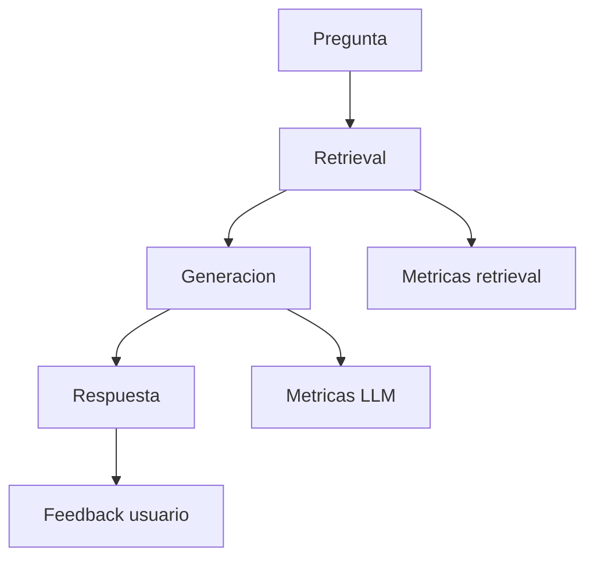

# Observabilidad y buenas practicas en RAG

Un RAG en produccion necesita las mismas disciplinas que cualquier servicio: logs, metricas, trazas, alertas y revision continua. Sin visibilidad, los usuarios reportan "responde mal" y el equipo no puede saber si fallo retrieval, el LLM o los datos.

## Que observar



## Logging estructurado

Registra por cada consulta:

```json
{
  "trace_id": "tr_abc123",
  "user_id": "u_42",
  "question": "como hacer backup postgres",
  "retrieval_ms": 45,
  "llm_ms": 1200,
  "chunks": [
    {"chunk_id": "postgresql-backup#2", "score": 0.89, "source": "..."}
  ],
  "model": "llama3.1:8b",
  "embedding_model": "nomic-embed-text",
  "tokens_in": 2100,
  "tokens_out": 180
}
```

No loguees contenido sensible sin politica de retencion y enmascaramiento.

## Metricas clave

| Metrica | Tipo | Uso |
|---------|------|-----|
| Latencia p50/p95 total | Histograma | SLA usuario |
| Latencia retrieval vs LLM | Desglose | Donde optimizar |
| Tokens entrada/salida | Contador | Coste |
| Cache hit rate | Gauge | Embeddings de preguntas |
| Feedback thumbs up/down | Contador | Calidad percibida |
| % respuestas "sin contexto" | Contador | Huecos en documentacion |
| Errores por etapa | Contador | Estabilidad |

## Trazas distribuidas

Con OpenTelemetry o LangSmith:

```txt
span: rag.query
  span: embed_question
  span: vector_search
  span: rerank
  span: llm_generate
```

Permite ver que etapa explota la latencia en una peticion lenta.

## Coste

```txt
coste ≈ (tokens_context + tokens_question) * precio_input
      + tokens_respuesta * precio_output
      + coste_embedding * documentos_nuevos
```

Optimizaciones:

- Reducir top-K y tamano de chunks.
- Cachear embeddings de preguntas repetidas.
- Modelos mas pequenos para tareas simples.
- Reindexacion incremental, no full diario.

## Seguridad

- **Autorizacion antes de retrieval:** filtra por `tenant_id`, `role`, `access_level`.
- **Prompt injection en documentos:** un PDF malicioso puede decir "ignora instrucciones". Sanitiza ingesta y separa system prompt de contexto usuario.
- **Exfiltracion:** limita que documentos puede ver cada usuario.
- **Rate limiting** por IP y por usuario.
- **Auditoria** de consultas sensibles.

## Operacion del indice

| Tarea | Frecuencia |
|-------|------------|
| Ingesta incremental | Al cambiar docs o diaria |
| Reindex completo | Al cambiar embedding model |
| Limpieza chunks huerfanos | Semanal |
| Backup del vector store | Segun politica DBA |
| Prueba smoke (1 pregunta gold) | Cada deploy |

## Versionado del pipeline

Etiqueta cada despliegue con:

```txt
ingestion_v3 + embedding_nomic-v1 + chunk_800_120 + prompt_v2
```

Asi correlacionas regresiones con cambios concretos.

## Alertas recomendadas

- Latencia p95 > umbral (ej. 8 s).
- Tasa de error > 1% en 5 min.
- Caida de recall@5 en eval automatico.
- Spike de respuestas vacias o "no se".
- Coste diario > presupuesto.

## Buenas practicas de produccion

- Entorno staging con subconjunto real del indice.
- Feature flags para reranker, hibrido o nuevo prompt.
- Runbook: "respuestas incorrectas tras deploy".
- Feedback in-app (util / no util).
- Revision semanal de preguntas con peor feedback.
- Documentar limites conocidos ("no cubre codigo fuente interno de X").

## Errores habituales

- Solo logs en stdout sin estructura ni trace_id.
- No medir retrieval por separado.
- Reindexar en produccion sin canary.
- Ignorar feedback de usuarios.
- Un unico indice para dev y prod.

## Checklist pre-produccion

- [ ] Dataset de eval con recall@5 aceptable
- [ ] Filtros de permisos en retrieval
- [ ] Logs sin PII o con politica clara
- [ ] Alertas de latencia y errores
- [ ] Runbook de rollback de indice
- [ ] Limite de coste o cuota por usuario
- [ ] Respuesta controlada cuando no hay contexto

## Cierre del manual

Has recorrido el ciclo completo: ingesta, chunking, embeddings, vector store, retrieval, reranking, generacion, evaluacion y operacion. El siguiente paso natural es integrar estos patrones con [LangChain](../langchain/01-introduccion.md) o construir un servidor con [MCP](../mcp/01-introduccion-al-model-context-protocol.md) para exponer herramientas a agentes.
